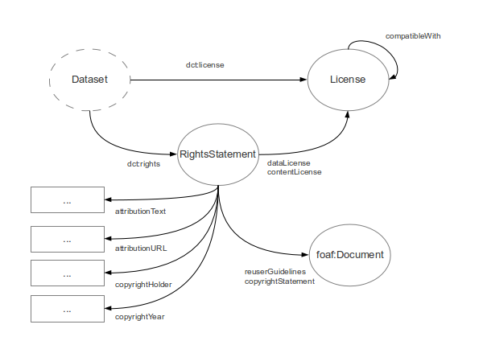

# Introduction

Data published to the web should always be accompanied by machine-readable metadata that describes the dataset, its means of creation and, importantly, a statement of the rights that relate to potential re-use of the data. 

While legal requirements vary across juristictions, a statement of rights will typically include some or all of the following information:

* A reference to a licence or waiver that relates to re-use of the dataset
* A reference to a licence or waiver that relates to re-use of the contents of the dataset, e.g where that content is covered by copyright
* Notices, e.g. copyright notices, that should be preserved by re-users
* Guidance on a means of attributing the source of the data, e.g. when re-used in an application
* Pointers to further information, e.g. further guidance on re-use or details on how to acquire additional rights

The Open Data Rights Statement vocabulary is intended to support the publication of machine-readable rights statements. The vocabulary builds on related work from the Dublin Core and Creative Commons communities and is intended to complement ongoing efforts to improve the quality of machine-readable dataset metadata. It is expected that the vocabulary will be useful in a number of contexts, e.g. for Linked Data publishing ([DCAT](http://www.w3.org/TR/vocab-dcat/), [VoiD](http://www.w3.org/TR/void/)), dataset distribution ([Data Packages](http://www.dataprotocols.org/en/latest/data-packages.html)), as well as data published via web APIs.

The following sections of the document provide more background on the vocabulary, including references to relevant related work.

## Related Work

There are several existing vocabularies cover similar goals, but all have their limitations. The Open Data Rights Statement vocabulary builds on this earlier work to support clearer publication of rights information.

* [Dublin Core](http://dublincore.org/documents/dcmi-terms/) distinguishes between a licence (`dct:License`) and a rights statement (`dct:RightsStatement`) and provides terms for relating a work to a machine-readable descriptions of these documents using the `dct:rights` and `dct:license` properties.
* The [Creative Commons vocabulary](http://creativecommons.org/ns) (ccRel) supports the publication of machine-readable descriptions of broad classes of requirements, permissions and prohibitions that are associated with licences. It also includes some terms to support attribution.
* The [Waiver](http://vocab.org/waiver/terms/.html) vocabulary supports the association of public domain waivers and community norms with a dataset
* The [Open Data Rights Language](http://www.w3.org/community/odrl/) (ODRL) provides a standard means for expressing policies relating to the publishing, distribution and consumption of digital media.
* Similarly, the [L4LOD](http://ns.inria.fr/l4lod/v2/l4lod_v2.html) and [LIMO](http://data.opendataday.it/LiMo/) vocabularies also attempt to describe the essential aspects of individual licenses

These vocabularies provide some of the necessary foundations for publishing rights statements, but each has its own limitations. As described in the next section, the ODRS vocabulary is intended to support the publication of "rights statements" that annotate the relationship between a dataset and its license information.

## Design Rationale

The key limitations with the existing vocabularies are:

* There is no recognition of the need to separately license a database and its contents. Even outside of the EU, it is entirely possible that the content of a database is covered by a separate licence to its structure. Where required there should be unambiguous ways to link to more than one license or waiver
* An unclear distinction between descriptions of a re-usable licence; a rights statement which might apply to several datasets, and the specific rights associated with an individual dataset. This leads to some confusion around how best to publish attribution requirements, copyright notices, etc.

The intention is that this vocabulary should allow data publisher to publish, as machine-readable metadata, the following information:

* A licence or waiver that applies to the database/data being published
* A licence or waiver that applies to the content of a database, where is needs to be separately recorded
* Copyright notices
* Guidance on attribution requirements
* Pointers to additional material, e.g. notes on usage of a licence, additional terms, etc.

The approach taken here borrows from Dublin Core and introduces a "Rights Statement" as a resource that relates a dataset to one or more Licenses as well as providing additional context that relates to re-use of a dataset.

The description of a License, such as the UK Open Government License, remains unchanged no matter how it is used or applied by an organisation. It is the Rights Statement that captures this customisation and description of copyright, attribution and other relevant relationships.

A Rights Statement might apply to an individual Dataset. But it could equally be applied to several Datasets, e.g. if an organization has a common set of attribution requirements.

The vocabulary does not provide a definition of dataset. This is intentionally under-specified to support the use of the vocabulary in a number of ways. The existing [Dublin Core](http://dublincore.org/documents/dcmi-terms/) terms (`dct:rights` and `dct:license`) can be used to relate a dataset to a `odrs:RightsStatement` or a licence.

Similarly, this vocabulary intentionally does not attempt to support the machine-readable description of the terms of a specific license. This is already adequately covered by the [ccRel](http://creativecommons.org/ns) and [ODRL](http://www.w3.org/community/odrl/) vocabularies. 

The ODRS vocabulary is aimed at supporting a simple, common case of publishing open data using standard licenses. However it is compatible with efforts to create machine-readable expressions of licenses and policies. Additional notes on the [use cases that have guided the design of the vocabulary](https://github.com/theodi/open-data-licensing/wiki/Use-cases) can be found in the project wiki.

## Schema Diagram

The following diagram shows the key resources, relationships and properties defined by this vocabulary.

## Recent Changes

For a full history of changes view [the source files in github](https://github.com/theodi/open-data-licensing/tree/master/schema).

The following lists highlights some of the key recent changes:

* 29/07/2013 -- Added links to L4LOD, LIMO and ODRL vocabularies in the Related Work section and links to Use Cases.

